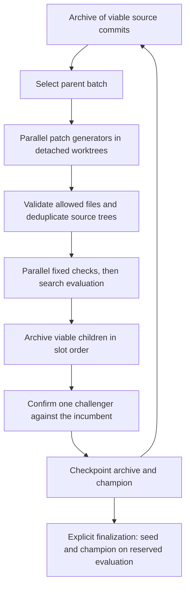

# Parallel source improvement — `gama rsi`

`gama rsi` runs persistent, bounded rounds of source-code improvement. Multiple
agents propose patches against archived parents; fixed checks and external scores
decide which sources remain useful and which one becomes the champion. A later
invocation can continue from that archive. `gama grow` remains the separate tool
for evolving model configurations.

The controller uses only Python's standard library and Git. Run locking requires
Linux (including WSL) or macOS. Gama's CI Python versions are 3.10–3.12.

For the optional Linux service using Astra proposals, independent Claude review,
and a bounded twice-daily schedule, see [AWS operations](rsi_operations.md).
The [first measured run](rsi_first_live.md) records the actual parser improvement
and its validation.

## Try it without a model

From the source checkout:

```bash
python3 examples/rsi_demo.py
```

The demo creates a temporary Git repository and a persistent run directory, uses
two deterministic patch emitters, evolves a small Python function, then finalizes
its reserved evaluation. Its JSON output locates the archive and `champion.patch`.
Use `--directory /absolute/path/to/new-demo` to choose where these artifacts live.

This exercises real subprocesses, source patches, Git commits, checks, archive
selection, and finalization. The emitters are programmed fixtures; their scores
are not evidence of autonomous LLM improvement.

## Run agents on gama

Install this checkout (`python3 -m pip install -e .`) and commit the source and
evaluation scripts you want to use as the seed. RSI reads **committed HEAD**;
uncommitted edits in your checkout do not become candidate inputs.

The [example configuration](../examples/rsi.example.json) asks two Ollama agents
to improve `gama/_json.py`, runs the regression suite, and measures JSON extraction
with [a fixed public evaluator](../examples/rsi_json_score.py). Set the backend
models and resource limits for your machine before starting. Both the controller
and configured Python commands should use the intended Python environment.

```bash
gama rsi --config examples/rsi.example.json --repo . \
  --state-dir ../gama-rsi-runs/json-parser --rounds 2

gama rsi --config examples/rsi.example.json --repo . \
  --state-dir ../gama-rsi-runs/json-parser --resume --rounds 2

gama rsi --config examples/rsi.example.json --repo . \
  --state-dir ../gama-rsi-runs/json-parser --resume --finalize
```

The first two commands search; the third opens the reserved final evaluation.
After finalization starts, that run can never search again. Repeating
`--resume --finalize` reports the saved result without reopening completed
measurements. If interrupted during finalization, it finishes only the missing
measurements.

Progress goes to stderr; stdout contains one JSON result. A result with the seed
as champion and an empty patch is a valid run with no confirmed improvement.
Inspect the candidate events for rejected proposals and measurement failures.

The result contains an immutable Git `ref`. Inspect the resulting source or put it
on a branch with normal Git commands:

```bash
git diff <base-from-result> <ref-from-result>
git worktree add -b review-rsi ../gama-rsi-review <ref-from-result>
```

RSI writes detached candidate commits and `refs/gama-rsi/...` references. It keeps
your checkout, index, and branch intact; exporting a champion does not merge or
push it. The cumulative `champion.patch` is relative to the recorded seed, so it
also includes changes inherited through a non-champion parent.

## One round



All parent draws use the archive as it existed at the start of the round.
Generation completes before parallel checks/search start. The coordinator
integrates results in assigned slot order, so completion speed cannot determine
which duplicate is retained or break a score tie. A seeded sampler makes these
decisions repeatable **given the same measured candidates**; it does not make
remote models or timing-based benchmarks deterministic.

An allowed, nonempty text patch must pass the configured checks and return valid
search measurements before admission. A viable child can enter the archive even
when its score falls below its parent's. Failed or unscored candidates remain in
the attempt records and do not become parents.

The DGM parent weight is:

```text
eligible: search_score < 1
weight = sigmoid(10 * (search_score - 0.5)) / (1 + viable_direct_children)
```

Sampling is with replacement. Failed attempts, duplicates, and grandchildren do
not count as direct children. There is no top-k pruning or implicit novelty
distance. Search stops when no eligible parents remain. Scores therefore need a
fixed, meaningful scale in `[0, 1]`, with higher being better and `1` representing
the task's ceiling. Use a fixed transformation if your underlying metric is loss
or latency; do not normalize against each batch's winners.

At most one new candidate per round reaches confirmation: the best search score,
with slot ID breaking ties, provided it is at least the incumbent's cached search
score. The incumbent and challenger are measured again in fresh worktrees,
serially. Promotion requires:

```text
min(challenger confirmation samples)
    > max(incumbent confirmation samples) + min_gain
```

This is an observed-range rule, not a statistical confidence bound. A failed
challenger confirmation prevents promotion while retaining its viable search
entry. Failure to remeasure the incumbent stops the unfinished round.
Confirmation is used repeatedly for selection; only the separately reserved
final evaluator is deferred until search ends.

## Configuration and command protocols

All configuration fields are validated; unknown keys are errors.

| Field | Meaning |
| --- | --- |
| `goal` | Fixed source-improvement objective, included in every proposal. |
| `allowed_paths` | Exact existing tracked UTF-8 source files, relative to the Git root. No globs, traversal, symlinks, test files/directories, or RSI controller files. |
| `agents` | Nonempty list of unique `name` plus either `backend` or `command`. Agents rotate over slots. |
| `checks` | Nonempty list of command argument arrays; every command must exit zero. Include regression and agent-functionality checks for the code you permit to change. |
| `search_command` | Command producing one JSON object with numeric finite `score` in `[0, 1]`. |
| `confirm_command` | Distinct command selecting the confirmation evaluation. |
| `sealed_command` | Optional distinct command, required for finalization. |
| `workers`, `batch_size` | Maximum simultaneous outer tasks and proposals per round; both default to `2`. |
| `timeout`, `evaluation_timeout` | Seconds per generator and per check/scoring process; defaults `600` and `180`. |
| `search_repeats`, `confirm_repeats` | Independent process invocations; defaults `1` and `3`. Finalization uses `confirm_repeats`. |
| `min_gain`, `seed` | Promotion margin on the fixed score scale and parent-sampling seed; both default to `0`. |
| `papers` | Optional list of `{title, url, notes}` with source-grounded context for proposals. |
| `evaluation_files` | Optional absolute paths to external evaluator scripts/data whose contents must remain unchanged. |

Commands are argument arrays, executed without a shell in the candidate worktree.
For example:

```json
{
  "checks": [["python3", "-B", "-m", "unittest", "discover", "-s", "tests", "-q"]],
  "search_command": ["python3", "-B", "fixed_score.py", "search"],
  "confirm_command": ["python3", "-B", "fixed_score.py", "confirm"],
  "sealed_command": ["python3", "-B", "fixed_score.py", "sealed"]
}
```

Those are fields of a complete configuration, not a complete runnable config.
Put fixed scripts in the seed commit outside `allowed_paths`, or call absolute
external scripts and list their dependencies in `evaluation_files`. The
evaluator must load the candidate from its working directory, rather than
accidentally measuring an installed package or the controller checkout.
Configured script/module paths and declared evaluator inputs cannot overlap
`allowed_paths`, including absolute paths to their copies in the caller's
checkout. Declare transitive evaluator/data dependencies in `evaluation_files`;
the controller does not infer imports or files read by arbitrary inline commands.
Scorers should locate editable source through their working directory, rather
than pass the editable file itself as a command argument.
Different command arrays alone do not prove the underlying datasets are
disjoint; constructing suitable splits is the evaluator author's responsibility.

A successful scoring process emits JSON only on stdout, for example
`{"score": 0.75, "passed": 9, "total": 12}`. Diagnostics can go to stderr. Additional
JSON fields are stored with the evaluation; search details are passed back as
feedback. Only aggregate confirmation score/samples enter proposal prompts.
Boolean scores, NaN, infinity, duplicate JSON keys, malformed output, nonzero
exits, and timeouts are measurement failures.

An agent using `backend` takes an existing `build_backend` specification, including
composites. The controller starts an isolated Python process using the **selected
parent's** `gama.config` and backend implementation before calling `complete`.
Evolved backend/tool/workflow code can therefore participate in the next source
modification. The outer RSI code and model weights remain fixed.

A `command` agent receives one JSON object on stdin:

```json
{
  "goal": "the fixed goal",
  "parent": "the selected commit SHA",
  "allowed_paths": ["gama/example.py"],
  "files": {"gama/example.py": "current source\n"},
  "feedback": {"search": {}, "confirm": null, "recent_failures": []},
  "papers": []
}
```

It must emit one unified diff with `a/` and `b/` prefixes. A single complete
`diff` Markdown fence is accepted; prose mixed with a patch is rejected. The
generator must return its patch without editing the worktree. The default
backend worker disables Python bytecode writes. Command agents inherit
`PYTHONDONTWRITEBYTECODE=1`.

An unchanged external command is a fixed modifier unless it explicitly runs the
selected parent's implementation. Passing parent source as text alone is not the
self-modifying agent mechanism in DGM.

## Persistence and limits

The state directory must sit outside the Git checkout. It contains:

- `state.json`: atomically replaced decision checkpoint and frozen run contract.
- `events.jsonl`: ordered proposal, rejection, confirmation, and checkpoint events.
- `attempts/<attempt>/<slot>/`: request, model response, diff, and result receipts.
- `result.json`: the latest exported result, pointing to an immutable
  `patches/<commit>.patch`; `champion.patch` is an atomically refreshed convenience
  copy. An interrupted export preserves the artifact referenced by the prior result.
- `worktrees/`: temporary detached candidates, removed after normal completion or
  a handled interruption.

A kernel lock prevents two coordinators from owning the same run. Resume checks
the configuration, repository path, RSI source fingerprint, Python major/minor,
and declared external evaluation file hashes. Inputs from other tracked files
come from the immutable seed and allowed descendant commits. External service
state, model aliases/weights, executable resolution, hardware contention, and
undeclared data are not frozen by these hashes.

Only completed rounds are decision checkpoints. Before dispatch, the coordinator
reserves the entire proposal batch. An interrupted unfinished round is retried
from its prior archive snapshot and receives a new attempt directory; both
attempts count in `reserved_proposals`. This is at-least-once execution, so a
remote model request may have consumed resources without yielding a stored
response. Worktree ownership receipts are saved before Git registers a candidate.
Resume recovers those detached worktrees under the run lock; unrelated or
unreceipted directories are preserved. A truncated final event is saved separately
before JSONL appends continue. Interrupted external/remote jobs may still need
backend-specific cancellation.

`--rounds` is a per-invocation limit on additional batches. Timeouts, a combined
stdout/stderr limit of 1 MiB per generator/check/scoring command, and `workers`
bound outer operations. Source prompts include at most 120,000 bytes in total.
Backend composites and user commands may have their own internal fanout. Token,
currency, disk, and model-server budgets require corresponding backend or
execution-environment limits. Archive and artifact storage grow with the run.

Git worktrees provide checkout separation, not an operating-system security
sandbox. Configured checks execute generated code with the process user's
permissions. Allowed-file validation, tracked-source/commit checks, and declared
evaluator hashes detect several kinds of accidental or persistent mutation; they
do not prevent arbitrary code from accessing network, credentials, or unrelated
files. Use an OS/container wrapper for commands when those boundaries are needed.
Likewise, “sealed” means the controller defers evaluation and closes the search
phase; a public fixture file in a candidate checkout is not secret.

## Research basis

The papers were located through alphaXiv and read in the versioned primary texts
linked below. The `papers` field supplies reviewed notes to agents; RSI does not
automatically search for or authenticate new papers.

| Source | Mechanism used and scope |
| --- | --- |
| [Darwin Gödel Machine](https://www.alphaxiv.org/abs/2505.22954), [v3 primary text](https://arxiv.org/html/2505.22954v3), §3, Algorithm 1, Appendix C.2 | Retain viable non-winners, sample archived parents with the sigmoid/direct-child formula, and let the selected parent's implementation generate descendants. Gama's configured checks define viability; the paper specifically tests compilation and code-editing functionality. |
| [AlphaEvolve](https://www.alphaxiv.org/abs/2506.13131), [v1 primary text](https://arxiv.org/html/2506.13131v1), §§2.2–2.6 | Measured source proposals, parallel work, and cheap checks before costly evaluation. Gama uses batch barriers; it does not reproduce the paper's asynchronous cluster pipeline or unspecified island/MAP-Elites policy. |
| [Automated Design of Agentic Systems](https://www.alphaxiv.org/abs/2408.08435), [v2 primary text](https://arxiv.org/html/2408.08435v2), §3 and Appendix H | Archive/feedback-informed executable agent design. Its outer search is sequential, so it is not the source of gama's parallel scheduler. |
| [Wider or Deeper? / AB-MCTS](https://www.alphaxiv.org/abs/2503.04412), [v5 primary text](https://arxiv.org/html/2503.04412v5), §3.4 and Appendix D | Context for adaptive branching. Gama already implements inference-time AB-MCTS in `gama/abmcts.py`; the source archive here uses DGM sampling instead of claiming a second AB-MCTS implementation. |

Deterministic slot integration, immutable Git refs, duplicate suppression,
checkpoint recovery, the observed-range promotion rule, and one-way finalization
are gama engineering choices. This is not a full reproduction of any paper.
Their large-model results do not establish gains on this machine, local-model
quality, parallel speedup, or indefinite recursive self-improvement. Report
actual independent evaluations and the `sealed_verdict` with any claimed source
improvement; the offline demo and orchestration tests establish mechanism behavior.
